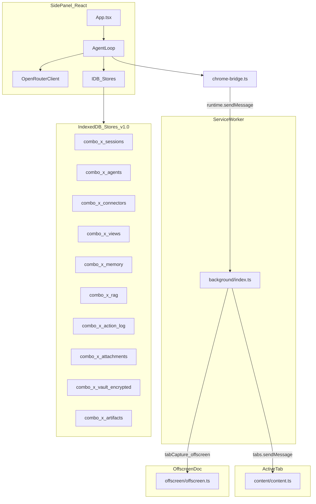
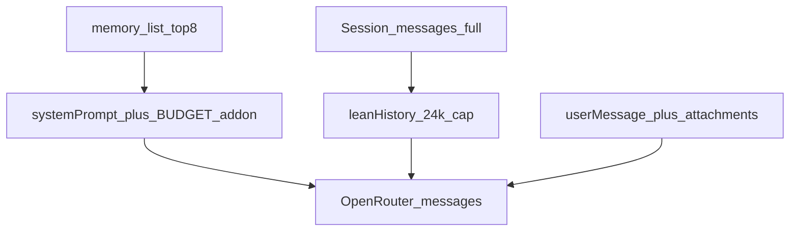
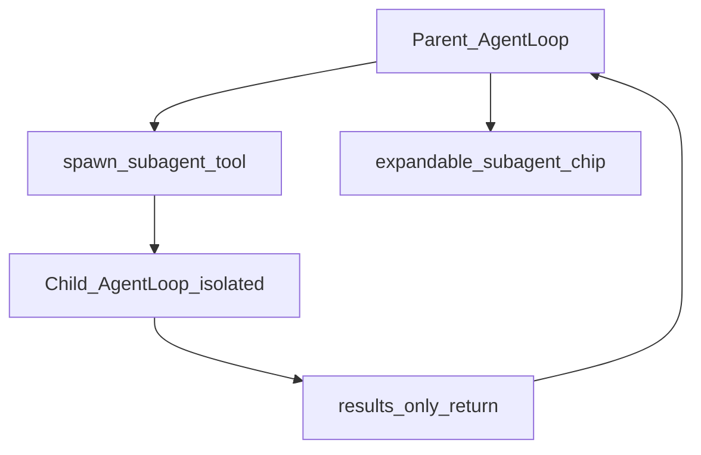
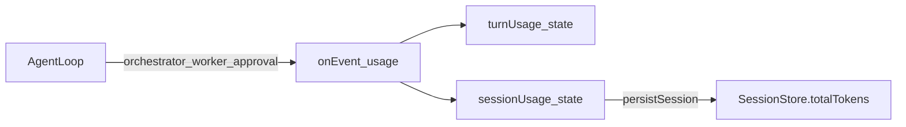
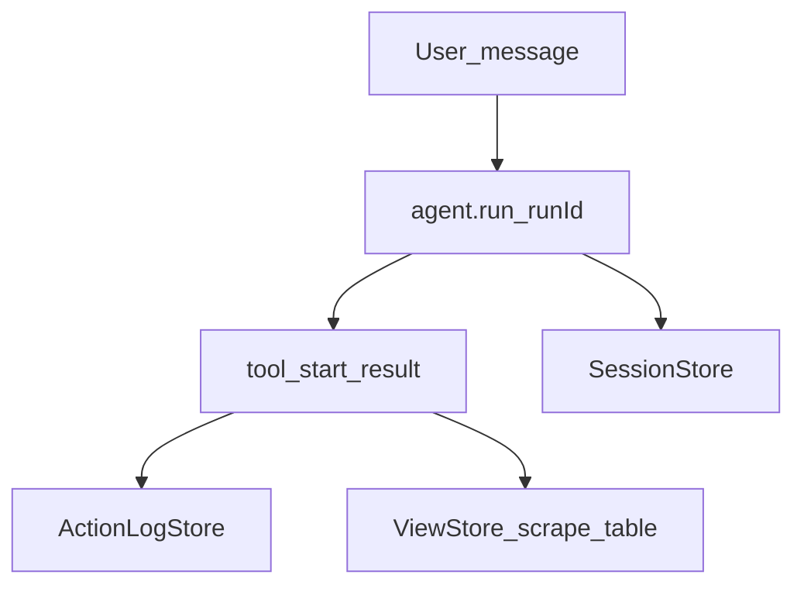

# Combo-X Architecture

**Version:** 1.1.0 (`feat/v0.9-budget-activity-rag`)  
**Stack:** Chrome MV3 extension · React side panel · `@combo-x/core` (shared logic) · OpenRouter tool-calling · IndexedDB local-first stores

Combo-X is a **local-first browser agent**: the orchestrator LLM plans steps, calls tools, and the extension executes DOM/media/API work on the user's machine. BYOK OpenRouter. v1.1 adds agentic control, sub-agents, usage charts, and task tracking.

---

## Repository layout

| Path | Role |
|------|------|
| `packages/core/` | Agent loop, tool schemas, stores, LLM client, protocol types |
| `extension/` | Chrome MV3 shell: side panel UI, service worker, content script, offscreen doc |
| `extension/dist/` | Build output — **Load unpacked** target in Chrome |
| `docs/` | Architecture and feature docs (this file) |

Key entry points:

| Component | File |
|-----------|------|
| Side panel UI | `extension/src/sidepanel/App.tsx` |
| Agent orchestrator | `packages/core/src/agent/loop.ts` (`AgentLoop`) |
| Tool catalog (schema source) | `packages/core/src/browser/tools.ts` (`AGENT_TOOLS`) |
| Chrome bridge | `extension/src/lib/chrome-bridge.ts` |
| Service worker | `extension/src/background/index.ts` |
| Content script | `extension/src/content/content.ts` |
| Offscreen (media) | `extension/src/offscreen/offscreen.ts` |
| Runtime protocol | `packages/core/src/protocol/messages.ts` |

---

## High-level system

The side panel owns the agent loop and all IDB stores. Browser operations route through the service worker to the active tab's content script. Heavy media work (tab recording, image crop/stitch) runs in an offscreen document.



### IndexedDB stores (v1.0)

| DB name | Store class | Purpose |
|---------|-------------|---------|
| `combo_x_sessions` | `SessionStore` | Chat history, per-turn usage, tool chips |
| `combo_x_agents` | `AgentProfileStore` | Multi-agent profiles + active picker |
| `combo_x_connectors` | `ConnectorStore` | REST + remote MCP connector defs |
| `combo_x_views` | `ViewStore` | Progressive scrape tables, saved snapshots |
| `combo_x_memory` | `MemoryStore` | Durable notes (`remember` / `recall`) |
| `combo_x_rag` | `RagStore` | Local folder index (chunks + handles) |
| `combo_x_action_log` | `ActionLogStore` | Durable tool audit trail |
| `combo_x_attachments` | `AttachmentStore` | Parsed PDF/CSV/image uploads |
| `combo_x_vault` | `Vault` | AES-GCM secrets (passphrase-derived) |
| `combo_x_artifacts` | `ArtifactStore` | Bookmarks, reminders, HTML reports |

Inspect helpers: `packages/core/src/local/idbInspect.ts` (`INSPECTABLE_DBS`).

---

## Agent loop

Each user message triggers one `AgentLoop.run()` call. The loop is a **tool-calling ReAct cycle**: orchestrator LLM → optional tool calls → tool results appended → repeat until the model returns plain text or `maxSteps` is hit.

```mermaid
sequenceDiagram
  participant UI as SidePanel
  participant Loop as AgentLoop
  participant LLM as OpenRouter
  participant Tools as executeTool
  participant Bridge as ChromeBridge

  UI->>Loop: run(userMessage,history,enabledTools,...)
  Loop->>Loop: buildUserContent + memoryInject + leanHistory
  loop EachStep_until_done_or_limit
    Loop->>LLM: chatStreaming(messages,filteredTools)
    LLM-->>Loop: content + toolCalls + usage
    alt NoToolCalls
      Loop-->>UI: done(finalText)
    else HasToolCalls
      loop EachToolCall
        Loop->>Loop: approve(sensitiveTools)
        Loop->>Tools: executeTool(name,args)
        Tools->>Bridge: runContent / navigate / ...
        Bridge-->>Tools: result
        Tools-->>Loop: tool_result_JSON
        Loop->>Loop: messages.push(role:tool)
      end
    end
  end
  Loop-->>UI: AgentRunResult(messages,usage,steps)
```

Implementation: `packages/core/src/agent/loop.ts`.

### Step limits (`maxSteps`)

Resolved by `resolveMaxSteps()` in `packages/core/src/agent/budget.ts`:

| Mode | Default steps | Override |
|------|---------------|----------|
| `budget` | 16 (`BUDGET_MAX_STEPS`) | `AgentRunOptions.maxSteps` |
| `normal` | 32 | `AgentRunOptions.maxSteps` |

When the limit is hit, the assistant message explains how to say "continue" or narrow the task.

### Worker model

Cheap secondary LLM (`workerModel`, default `google/gemini-3.5-flash` from `packages/core/src/models.ts`) handles:

- `parse_data` — structured JSON extraction from page text
- `scrape_catalog` — per-page parse inside the catalog loop
- `auto_llm` approval gate — yes/no safety verdict

Worker usage is emitted as `AgentEvent` with `usageSource: "worker"`.

### Budget mode

When `budgetMode === "budget"`:

- System prompt gets `BUDGET_SYSTEM_ADDON` (`packages/core/src/agent/budget.ts`)
- `get_page` without mode → rewritten to `page_digest` or capped snippet
- `get_page mode=full` → rejected with error
- Orchestrator is steered toward `page_digest`, `scrape_pdps`, `parse_data`, tight selectors

See [`docs/BUDGET.md`](./BUDGET.md).

### Approval gate

Sensitive tools (`SENSITIVE_TOOLS` in `packages/core/src/protocol/messages.ts`) require approval unless `approvalMode` is `auto_all` or `auto_llm` approves. UI shows a modal via `tool_approval` events; decisions are logged to `ActionLogStore`.

---

## Tool attachment per orchestrator turn

On **every** loop step, tools are filtered before the OpenRouter call:

```typescript
// packages/core/src/agent/loop.ts (simplified)
const tools =
  options.enabledTools?.length
    ? AGENT_TOOLS.filter((t) => options.enabledTools!.includes(t.function.name))
    : AGENT_TOOLS;
```

Resolution order in `extension/src/sidepanel/App.tsx`:

1. **Active agent profile** — if `toolAllowlist === "all"` → all tool names; else profile list
2. **No profile / empty allowlist** — `enabledTools` from side panel Tools tab (`localStorage` key)
3. Passed to `AgentLoop.run({ enabledTools: runTools })`

Connector scoping is separate: `ConnectorRuntime.allowedIds` from `AgentProfile.connectorIds`.

```mermaid
flowchart LR
  Profile["AgentProfile.toolAllowlist"]
  Global["localStorage_enabledTools"]
  AllNames["AGENT_TOOLS_names"]
  Filter["AGENT_TOOLS.filter"]
  LLM["OpenRouter_tools_param"]

  Profile -->|all| AllNames
  Profile -->|string[]| Filter
  Global -->|no_profile| Filter
  AllNames --> Filter
  Filter --> LLM
```

UI grouping for the Tools tab: `extension/src/sidepanel/toolGroups.ts` (`TOOL_GROUPS`).

Full catalog: [`docs/TOOLS.md`](./TOOLS.md).

---

## Memory inject + lean history

### Memory inject (first turn only)

Before the first orchestrator call, `formatMemoryInject()` loads the top 8 recent memories from `MemoryStore` and appends a `USER MEMORIES` block to the system prompt. Same store as `remember` / `recall` / `memory_list` tools.

```typescript
// packages/core/src/agent/loop.ts
const memBlock = await this.formatMemoryInject();
messages = [
  { role: "system", content: memBlock ? `${systemBase}\n\n${memBlock}` : systemBase },
  ...leanHistory(options.history ?? []),
  { role: "user", content: userContent },
];
```

Memory scoring: keyword + recency (`packages/core/src/memory/store.ts`).

### Lean history (subsequent turns)

`leanHistory()` (`packages/core/src/agent/leanHistory.ts`) prepares prior chat for the next LLM call:

- Drops `role: tool` messages entirely
- Drops prior `role: system` rows
- Assistant rows with `tool_calls` → short crumb (`[tools: click, page_digest, …]`)
- Trims from the **front** until under **24 000** chars (keeps newest)

After each run, `App.tsx` persists `leanHistory(stripImageParts(result.messages))` into `historyRef` for the next turn — images are stripped from history to save tokens.



---

## Sub-agent nesting (v1.1 — shipped)

> Protocol + UI: [`docs/SUBAGENTS.md`](./SUBAGENTS.md). Implementation: `spawn_subagent` in `loop.ts`, `SubagentStrip.tsx`.

Parent orchestrator spawns an isolated child `AgentLoop` via `spawn_subagent`. Child history does not pollute parent context; parent receives a compact `{ ok, summary, artifacts }` envelope only. Default max nesting depth: **1**.



Requires `AgentProfile.canDelegate` (v1.1 field). See [`docs/AGENTS.md`](./AGENTS.md).

---

## Usage telemetry

### v1.0 (shipped)

Usage flows through `AgentEvent` emissions; the side panel aggregates in React state and persists per session.



| Source | `usageSource` | Where used |
|--------|---------------|------------|
| Orchestrator | `orchestrator` | Per-step chat completion |
| Worker (`parse_data`, etc.) | `worker` | Cheap extraction calls |
| Approval gate | `approval` | `auto_llm` yes/no |

Files:

- Event types: `packages/core/src/agent/loop.ts` (`AgentEvent`)
- Aggregation: `extension/src/sidepanel/App.tsx` (`onEvent`, `persistSession`)
- Per-turn display: assistant turn footer (`tok · $`)
- Session totals: `ChatSession.totalTokens`, `estimatedCostUsd` in `packages/core/src/sessions/store.ts`

Cost estimation: `OpenRouterClient.estimate()` in `packages/core/src/llm/openrouter.ts`.

### v1.1 (shipped): `UsageStore`

Durable telemetry (`packages/core/src/usage/store.ts`) for charts:

- Append on LLM / tool / message events (model, provider, tokens, cost, sessionId, runId, agentId)
- Side panel **Usage** tab: KPIs + model/provider bars (`UsagePanel.tsx`)
- Complements session-level totals in `SessionStore`

---

## Task tracking

### v1.0 (shipped): session-scoped work

- **Chat sessions** (`SessionStore`) — title, messages, tool chips, usage per turn
- **Progressive scrape tables** (`ViewStore` + `ensure_scrape_table` / `upsert_scrape_rows` / `scrape_pdps`) — durable rows across long runs
- **Activity log** (`ActionLogStore`) — every tool call with approval decision, page URL, redacted args
- **Run IDs** — `App.tsx` generates `runId` per `agent.run()` for log correlation



### v1.1 (shipped): task board

`TaskStore` (`packages/core/src/tasks/store.ts`) — session + global:

- Tools: `create_task`, `update_task`, `list_tasks`
- UI: **Tasks** tab (`TasksPanel.tsx`)
- Status: `open` | `in_progress` | `blocked` | `done`

---

## Tool control / auto-agent creation (v1.1 — shipped)

### Manual allowlists (v1.0+)

- Global Tools tab → `localStorage` enabled set
- Per-agent `toolAllowlist` in `AgentProfileStore`
- Settings → Agents UI: `extension/src/sidepanel/SettingsPanel.tsx`

### Worker-filtered catalog (`pickToolsForGoal`)

On `create_agent`, a **worker LLM** reads the goal + `TOOL_CATALOG` and returns a subset of tool names. The loop also builds the filtered schema array **once per run** (still re-sent each turn).

```mermaid
sequenceDiagram
  participant OR as OrchestratorLLM
  participant Worker as WorkerLLM
  participant Loop as AgentLoop
  participant Store as AgentProfileStore

  OR->>Loop: create_agent_goal
  Loop->>Worker: pickToolsForGoal_catalog
  Worker-->>Loop: toolNames_subset
  Loop->>Store: put_profile_allowlist
  Loop-->>OR: agent_id_summary
```

Also shipped:

- **`create_agent` / `update_agent` / `list_agents`** when `canSelfEdit`
- **`spawn_subagent`** when `canDelegate` (depth 1)

See [`docs/AGENTS.md`](./AGENTS.md) · [`docs/TOOLS.md`](./TOOLS.md).

---

## Browser execution path

DOM tools map through `toolArgsToContentRequest()` → `BrowserBridge.runContent()` → service worker → content script `handleContentRequest()`.

Tab lifecycle tools (`open_tab`, `navigate`, `list_tabs`, …) use dedicated runtime message types (`RuntimeMessageSchema`).

Media tools route to `extension/src/lib/media-bridge.ts` → offscreen document for recording, crop, and stitch.

```mermaid
sequenceDiagram
  participant Loop as AgentLoop
  participant Bridge as ChromeBridge
  participant SW as ServiceWorker
  participant CS as ContentScript

  Loop->>Bridge: runContent(page_digest)
  Bridge->>SW: type:content
  SW->>CS: tabs.sendMessage
  CS-->>SW: ContentResponse
  SW-->>Bridge: ok_data
  Bridge-->>Loop: result
```

Content handlers: `packages/core/src/browser/content-handlers.ts` (shared logic; content script imports handlers).

---

## Connectors + vault

- **Connectors** — user-defined REST/MCP endpoints in `ConnectorStore`; secrets referenced as `{ vaultLabel: "…" }` and resolved at call time
- **Vault** — passphrase-derived AES-GCM; stores OpenRouter key, connector tokens, `site_profile:*` login recipes
- **Tools** — `rest_request`, `mcp_list_tools`, `mcp_call` in `AgentLoop.executeTool()`

See [`docs/CONNECTORS.md`](./CONNECTORS.md).

---

## RAG + attachments

- **RAG** — File System Access API grant → `RagStore` index → `rag_search` / `rag_read_file` tools. See [`docs/LOCAL_RAG.md`](./LOCAL_RAG.md).
- **Attachments** — drag/drop in chat → `AttachmentStore` → inline preview in user message + `read_attachment` tool

---

## Views + progressive scrape

Scrape workflows use `ViewStore` as a live table:

1. `ensure_scrape_table` — create/open view with columns
2. `scrape_pdps` or manual navigate + `page_digest` + `upsert_scrape_rows`
3. `get_scrape_table` — progress check
4. `export_csv` / `save_view` — export

UI table: Views tab in side panel. See [`docs/VIEWS.md`](./VIEWS.md).

---

## Build + test

```bash
cd combo-x
pnpm install
pnpm test      # Vitest — packages/core
pnpm build     # CRXJS Vite → extension/dist
pnpm test:e2e  # Playwright smoke (optional)
```

Load `extension/dist` as unpacked MV3 extension. Version pinned in `extension/manifest.json` and `extension/package.json` (`1.0.0`).

---

## Related docs

| Doc | Topic |
|-----|-------|
| [`docs/TOOLS.md`](./TOOLS.md) | Full tool catalog + groups |
| [`docs/AGENTS.md`](./AGENTS.md) | Agent profiles |
| [`docs/SUBAGENTS.md`](./SUBAGENTS.md) | Sub-agent protocol (v1.1) |
| [`docs/BUDGET.md`](./BUDGET.md) | Budget mode |
| [`docs/CONNECTORS.md`](./CONNECTORS.md) | REST/MCP |
| [`docs/VIEWS.md`](./VIEWS.md) | Progressive tables |
| [`docs/LOCAL_RAG.md`](./LOCAL_RAG.md) | Device RAG |
