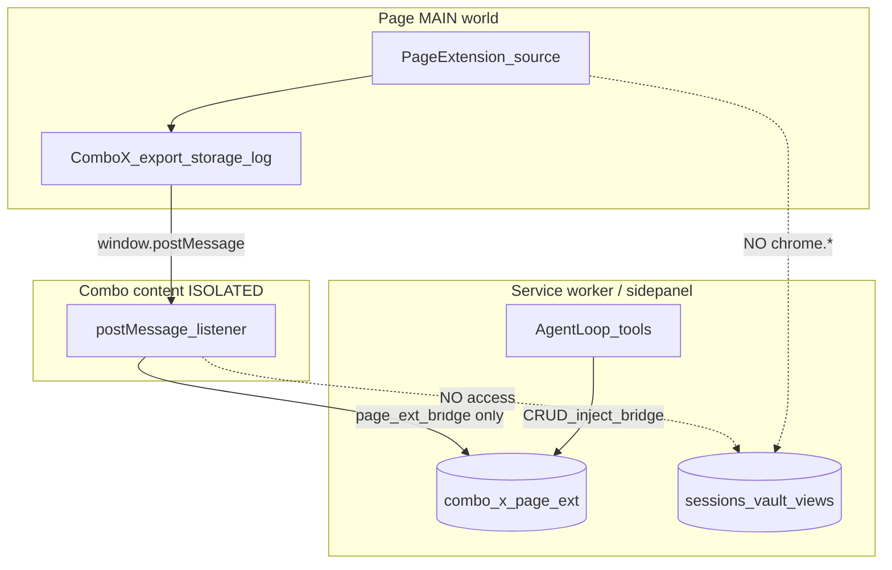

# Page extensions (browser userscripts)

**Shipped in v1.2** — MAIN-world inject, isolated IDB, agent-only bridge, full audit.

## Isolation model



| Rule | Enforcement |
|------|-------------|
| No `chrome.*` in user scripts | Inject with `world: "MAIN"` only |
| No Combo sessions/vault/views | Separate DB `combo_x_page_ext` |
| No programmatic Combo control | Content script ignores non-bridge envelopes; SW never maps bridge → RuntimeMessage tools |
| Data out only via agent bridge | `bridge` null by default; `set_page_extension_bridge` required |
| Approve is human-only | Agent `approve_page_extension` returns error; UI Approve sets `approvedBy: user` |
| Bridge ops require live match | SW rejects unless approved + enabled + `urlMatches(pageUrl)` |

**Hardening (v1.3):** each inject mints a `bridgeToken`; content forwards it; SW rejects mismatches. Auto-nav inject only when `autoInject: true`. Overbroad patterns (`*`, `https://*/*`) rejected at create/update. Do **not** store passwords in page-ext storage — use Combo Vault + `login` (storage values still arrive in MAIN via postMessage).

## Lifecycle

1. `create_page_extension` → **draft**, disabled  
2. Edit in **Page ext** tab or `update_page_extension`  
3. `approve_page_extension` (sensitive)  
4. `update_page_extension` `{ enabled: true }`  
5. Optional: `set_page_extension_bridge` `{ exportChannels, allowStorage }`  
6. `inject_page_extension` or auto-inject on `tabs.onUpdated` complete  

Source change → approval resets to **draft**.

## ComboX API (inside source)

```js
ComboX.id          // extension id
ComboX.name
ComboX.export(channel, payload)   // requires bridge.exportChannels
ComboX.storage.get/set/delete/list // requires bridge.allowStorage
ComboX.log(msg)                   // audit only
```

Exports land in isolated data under `export:<channel>`. Agent reads with `page_ext_data_get`.

## Traceability

- Per-extension audit store (`create` / `approve` / `inject` / `export` / `storage_*` / …)
- `sourceHash` (SHA-256) on create/approve
- ActionLog redacts full `source` for create/update tools
- UI: Page ext → Audit list

## Tools

`create_page_extension`, `update_page_extension`, `list_page_extensions`, `get_page_extension`, `approve_page_extension`, `revoke_page_extension`, `inject_page_extension`, `set_page_extension_bridge`, `page_ext_data_*`, `list_page_extension_audit`

## Example use-cases

| Idea | Patterns | Bridge |
|------|----------|--------|
| Allegro viewed products | `https://allegro.pl/*` | storage + `exportChannels: ["viewed"]` |
| Third-party page enhancer | site origin glob | optional export |
| Game bot helpers | game origin | usually no bridge |
| Password helper UI | login origins | **prefer Combo Vault + login tool** — do not put master secrets in page scripts |

## Files

- `packages/core/src/pageExtensions/*`
- `extension/src/lib/page-ext-inject.ts`
- `extension/src/content/content.ts` (bridge listener)
- `extension/src/sidepanel/PageExtensionsPanel.tsx`
