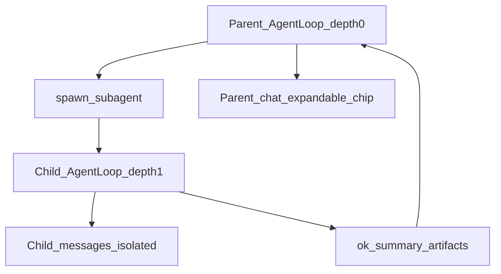
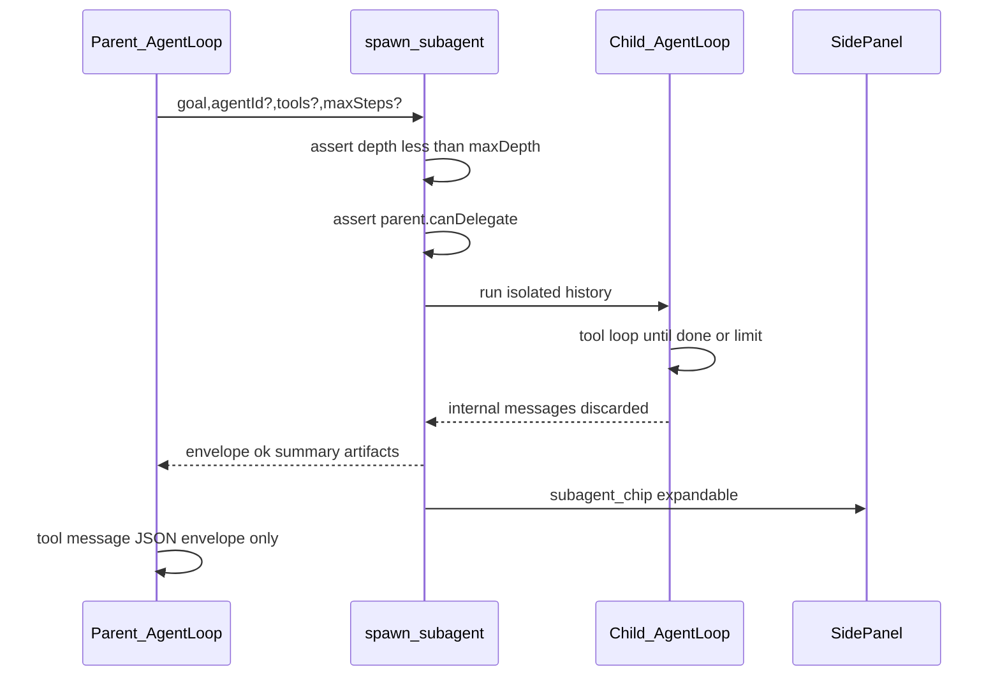

# Sub-agents protocol

> **Status: shipped in v1.1.0** — `spawn_subagent` in `packages/core/src/agent/loop.ts`; UI: `SubagentStrip.tsx`.

Sub-agents let the **parent orchestrator** delegate a focused sub-goal to a **child** `AgentLoop` run with isolated history. The parent never sees the child's full message trace — only a compact result envelope.

---

## Goals

| Goal | Rationale |
|------|-----------|
| Isolated child history | Avoid token blow-up in parent context |
| Results-only return | Parent plans from summary + artifact refs, not raw tool JSON |
| Depth limit 1 | Prevent runaway nesting / cost explosions |
| Same local-first rules | Child uses same bridge, vault, stores — no cloud agent |
| UI transparency | User can expand sub-agent chip to see child tool trace |

---

## Nesting model



| Rule | Value |
|------|-------|
| Default max nesting depth | **1** (parent → child only; child cannot spawn) |
| Child history in parent | **Never** — only envelope JSON |
| Child `maxSteps` | Default 16 budget / 32 normal; overridable per spawn |
| Child tools | Subset of parent `enabledTools` or explicit list |
| Child agent profile | Optional `agentId` → `AgentProfileStore.get()` |

Parent must have `canDelegate: true` on its profile (v1.1 field — see [`docs/AGENTS.md`](./AGENTS.md)).

---

## `spawn_subagent` tool (v1.1)

Planned schema (to be added to `AGENT_TOOLS`):

```typescript
{
  name: "spawn_subagent",
  description: "Run a focused sub-task in an isolated agent loop. Returns summary only.",
  parameters: {
    type: "object",
    properties: {
      goal: { type: "string", description: "Clear sub-goal for the child" },
      agentId: { type: "string", description: "Optional AgentProfile id" },
      tools: {
        type: "array",
        items: { type: "string" },
        description: "Tool allowlist override; default = parent enabledTools",
      },
      maxSteps: { type: "number", description: "Child step cap" },
    },
    required: ["goal"],
  },
}
```

### Spawn flow



Implementation sketch (v1.1):

- `AgentLoop.executeTool()` branch for `spawn_subagent`
- New `SubAgentRunner` or recursive `AgentLoop.run()` with `parentDepth` + `isolated: true`
- Child `onEvent` mirrored to UI sub-chip store (not parent `historyRef`)
- Child abort propagates from parent `AbortSignal`

---

## Return envelope

Parent `role: tool` content is **only** this JSON (no child assistant/tool rows):

```json
{
  "ok": true,
  "summary": "Extracted 42 EAN rows from category pages 1–3; 2 PDPs failed (timeout).",
  "artifacts": {
    "viewId": "uuid-of-scrape-table",
    "viewName": "foodwell-ean-map",
    "rowCount": 42,
    "csvDownloaded": false,
    "errors": ["SAP-123: digest failed"]
  },
  "usage": {
    "totalTokens": 18420,
    "estimatedCostUsd": 0.04,
    "steps": 8
  },
  "childRunId": "uuid"
}
```

| Field | Required | Meaning |
|-------|----------|---------|
| `ok` | yes | Child finished without fatal error |
| `summary` | yes | 1–3 sentences for parent planning |
| `artifacts` | no | IDs/pointers child produced (views, files, memories) |
| `usage` | no | Child token/cost rollup |
| `childRunId` | no | Correlate with `ActionLogStore` / future `TaskStore` |

On failure:

```json
{
  "ok": false,
  "summary": "Child hit step limit before completing catalog scrape.",
  "error": "hit_step_limit",
  "artifacts": { "viewId": "…", "rowCount": 12 }
}
```

---

## UI: expandable sub-agent chip

v1.1 side panel behavior (`extension/src/sidepanel/App.tsx`):

1. Parent turn shows a **Sub-agent** chip when `spawn_subagent` runs (like existing tool chips).
2. Collapsed: goal + `summary` + `ok` badge + child token cost.
3. Expanded: child tool trace (names, args redacted, results summarized) — loaded from ephemeral child event buffer or `ActionLogStore` filtered by `childRunId`.
4. User can **Stop** child via parent abort signal.

Does not add child messages to session export / `leanHistory` pipeline.

---

## Depth and delegation guards

| Guard | Behavior |
|-------|----------|
| `depth >= maxDepth` (default 1) | Return `{ ok: false, error: "max_nesting_depth" }` |
| `!canDelegate` on profile | Tool not in filtered catalog |
| Child calls `spawn_subagent` | Rejected at execute time (depth 1 hard cap) |
| Parent aborted | Child `signal` aborted; envelope `ok: false, error: "aborted"` |

`maxDepth` may become configurable per profile in a later release; default stays **1**.

---

## Logging + tasks

- Child tool calls logged to `ActionLogStore` with `runId = childRunId` and `sessionId` = parent session
- v1.1 `TaskStore`: optional link `taskId` on spawn args; child completion updates task status

---

## Testing checklist (v1.1 implementers)

- [ ] Parent with `canDelegate: false` never sees `spawn_subagent` in tools
- [ ] Child history length > 0 but parent `leanHistory` unchanged by child rows
- [ ] Envelope `artifacts.viewId` opens correct row in Views tab
- [ ] Depth-2 spawn returns `max_nesting_depth` without LLM call
- [ ] Child `maxSteps: 1` returns `hit_step_limit` envelope
- [ ] Expand chip shows child tools; collapse hides them

---

## Related

- Architecture overview: [`docs/ARCHITECTURE.md`](./ARCHITECTURE.md#sub-agent-nesting-v11-design-target)
- Agent profiles (`canDelegate`): [`docs/AGENTS.md`](./AGENTS.md)
- Tool catalog: [`docs/TOOLS.md`](./TOOLS.md)
