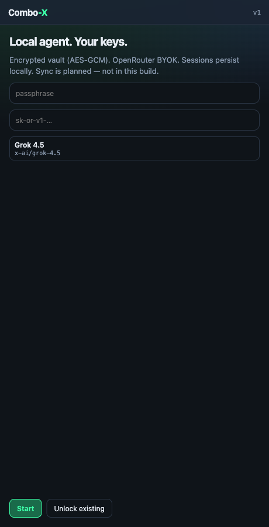
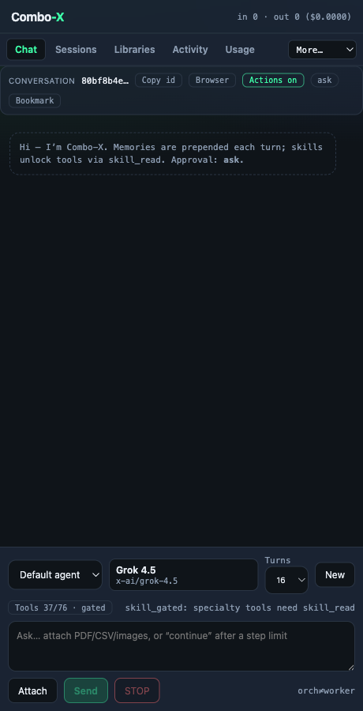
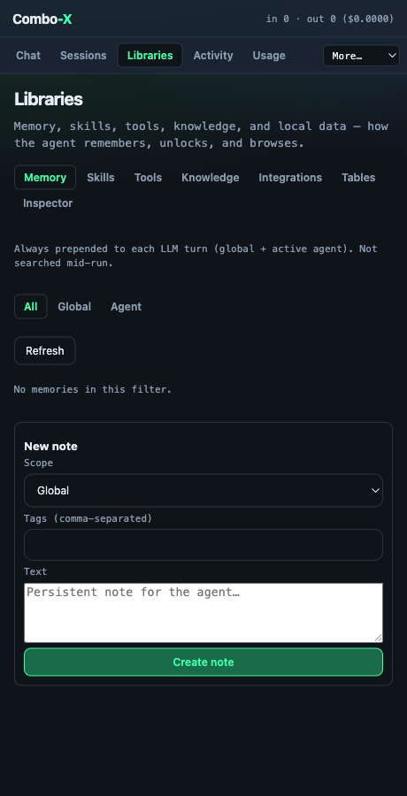
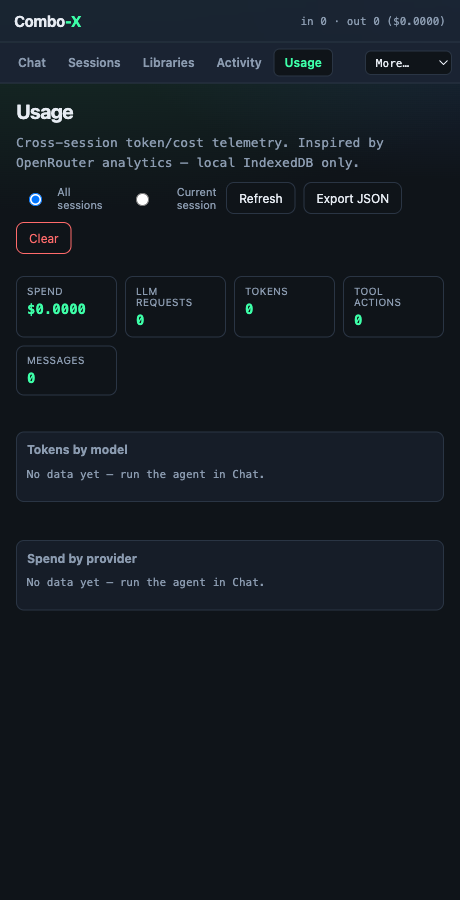
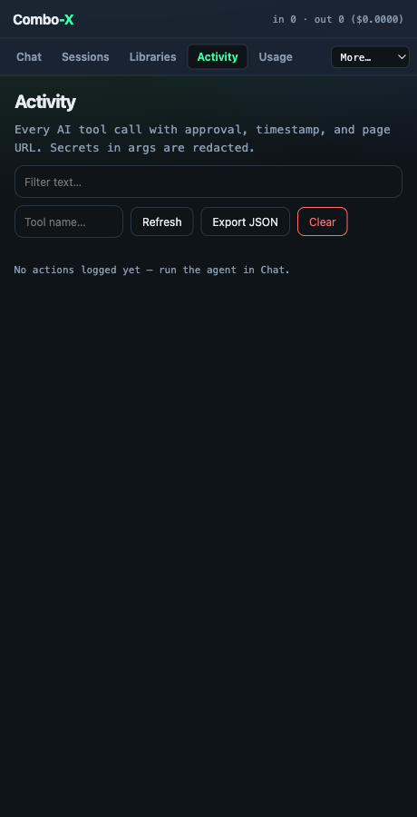

# Combo-X User Guide

Combo-X is a **local-first browser agent** — a Chrome/Firefox side-panel assistant
that can read, navigate, and act on web pages using the LLM of your choice
(OpenRouter, OpenAI, Ollama, or any OpenAI-compatible endpoint). Your keys,
sessions, memories, and secrets stay in your browser (IndexedDB + an encrypted
vault). Nothing is sent to a Combo-X server.

> New here? Read [Getting started](#getting-started) then jump to a
> [use case](#use-cases). Power users: see [FEATURES](./FEATURES.md) and
> [TOOLS](./TOOLS.md).

## Getting started

1. Install the extension (Chrome: load `extension/dist`; Firefox: see [FIREFOX](./FIREFOX.md)).
2. Open the side panel and complete onboarding:
   - Set a **passphrase** — this derives the AES-GCM key for your secret vault.
   - Paste your **API key** (BYOK — stored encrypted). Defaults to OpenRouter; change
     provider / base URL in Settings (see [PROVIDERS](./PROVIDERS.md)).

3. Start chatting. Pick a model, an approval mode, and (optionally) budget mode.
4. **Pick element** (composer) — click a control on the active tab; Combo-X attaches a
   selector + interactive index so the agent can inspect/`click_index`/`type_index` it.

The chat footer shows live state such as `Tools 37/76 · gated` — Combo-X starts with
a lean always-on toolset and unlocks specialist tools on demand (see
[Skills & tools](#how-skills--tools-work)).

## Core concepts

| Concept | What it means |
|---------|---------------|
| **BYOK + vault** | Your LLM API key and connector secrets are encrypted with your passphrase. |
| **Approval modes** | `ask` (confirm each sensitive action), `auto_llm` (cheap safety check), `auto_all` (trusted). |
| **Budget mode** | Caps steps + page payloads to control token spend. |
| **Skills** | On-demand playbooks that unlock tool packs (scrape, REST/MCP, RAG, page-ext, media). |
| **Memory** | Notes that are always prepended to context so the agent remembers facts. |
| **Sub-agents** | The agent can delegate a sub-task to a scoped child agent. |
| **Page extensions** | Approved MAIN-world userscripts with a permissioned data bridge. |

## The interface

### Libraries — Memory, Skills, Tools, Knowledge, Integrations, Tables, Inspector
Everything the agent can draw on, in one place.

### Usage — token & cost telemetry (local only)
Per-model and per-provider spend, tokens, tool actions, and messages — all from
local IndexedDB. Export to JSON anytime.

### Activity & Sessions
Activity is a redacted audit trail of every tool call. Sessions persist your chats
with per-message token/cost accounting and full-text search.

## How skills & tools work

Combo-X has **78 tools** grouped into an always-on core plus skill-gated packs.
Instead of overwhelming the model with every tool, it:

1. Starts with ~36 always-on tools (browse, memory, tasks, agent meta-tools).
2. When a goal needs specialist capability, the agent calls `skill_read`, which
   **unlocks** the matching pack (e.g. `combo-scrape` → the 14 scrape tools).
3. Sensitive actions (click, navigate, login, connectors, page-ext lifecycle) pass
   through your chosen approval mode first.

This keeps prompts small and cheap while still exposing deep capability. See
[FEATURES §1–2](./FEATURES.md#1-tools-78-total-7-categories).

## User stories

- **As a privacy-conscious user**, I want my API key and browsing data to stay on my
  device, so that no third-party server sees my activity. → BYOK + encrypted vault + local IndexedDB.
- **As a researcher**, I want the agent to read a long article and save key facts, so
  that later chats recall them. → `page_digest` + `remember`/`recall`.
- **As an analyst**, I want to extract a product catalog into a table and export CSV,
  so that I can work with it in a spreadsheet. → `combo-scrape` skill → `scrape_pdps`/`export_csv`.
- **As a power user**, I want to call my company's REST API from a chat, so that I can
  combine web data with internal systems. → `combo-rest` skill + Connectors (vault-backed secrets).
- **As a cost-aware user**, I want to cap token spend, so that a long task doesn't get
  expensive. → Budget mode + Usage analytics.
- **As a cautious user**, I want to approve any action that clicks or logs in, so that
  the agent never acts destructively without me. → Approval mode `ask`.
- **As a builder**, I want to inject a small script into a page and read data back
  safely, so that I can automate a site I trust. → Page extensions + permissioned bridge.

## Use cases

### 1. Summarize & remember a page
> "Summarize this page and remember the 3 key points for later."

Agent runs `page_digest`, replies with a summary, and stores memories. Future chats
prepend them automatically.

### 2. Scrape a catalog to CSV
> "Extract all products on this category page into a table with name, price, EAN, then export CSV."

Agent reads the `combo-scrape` skill, defines a scrape table, uses `scrape_pdps`, and
calls `export_csv`. Progressive tables handle large sets without dumping full pages.

### 3. Fill a form / log in (with approval)
> "Log into this site using my saved profile and go to my orders."

Agent uses `login` with a vault-stored site profile; each sensitive step is gated by
your approval mode.

### 4. Query an internal API mid-chat
> "Call our inventory API for SKU 12345 and compare it to the price on this page."

Agent reads `combo-rest`, resolves the connector's secret from the vault, calls
`rest_request`, and reconciles against the scraped page value.

### 5. Local knowledge (RAG) + attachments
> "Using my docs folder, answer how our returns policy applies to this order."

Agent uses `combo-rag` to search an indexed local folder and any attached PDFs.

### 6. Delegate a sub-task
> "Research three competitors and summarize each."

Agent spawns scoped sub-agents, each with its own budget, and merges results.

## Safety & privacy

- Secrets are AES-GCM encrypted (PBKDF2, 100k iterations) behind your passphrase.
- Sensitive tools require approval; page-extension approve/inject **always** ask.
- Every tool call is written to a redacted local action log.
- No telemetry leaves your device. Usage stats are local-only.

See [AUDIT](./AUDIT.md) for the full security review and known hardening items.

## Screenshots are reproducible
All screenshots in this guide are generated by the e2e harness
([e2e/screens.spec.ts](../e2e/screens.spec.ts)) — run `pnpm test:e2e` to regenerate
them into `e2e/artifacts/`. See [DEBUGGING](./DEBUGGING.md).
